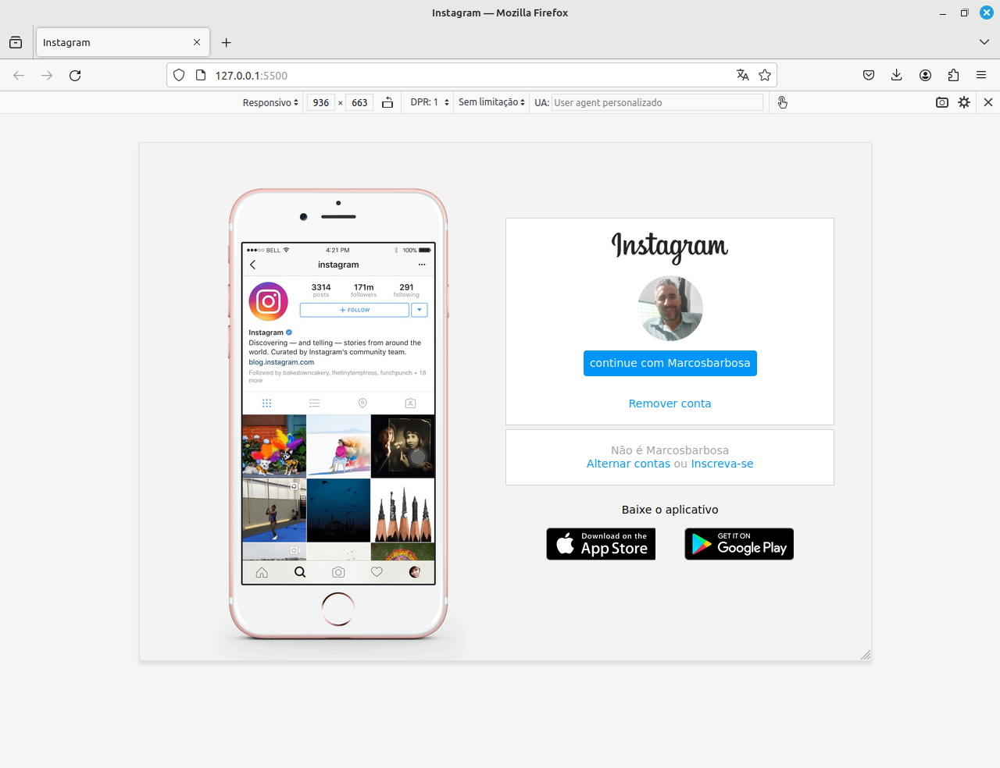

# RECRIANDO A PÁGINA INICIAL DO INSTAGRAM

# DESAFIO DE PROJETO

Nesse projeto você terá o desafio de reconstruir a página de login do Instagram. Para isso, é recomendado o uso de CSS com Flexbox, uma das abordagens de posicionamento de elementos mais utilizadas quando se trata de responsividade. 

# ORIENTADORA

Gabriela Pinheiro 

# BOOTCAMP

Santander Fullstack Developer com a  DIO

